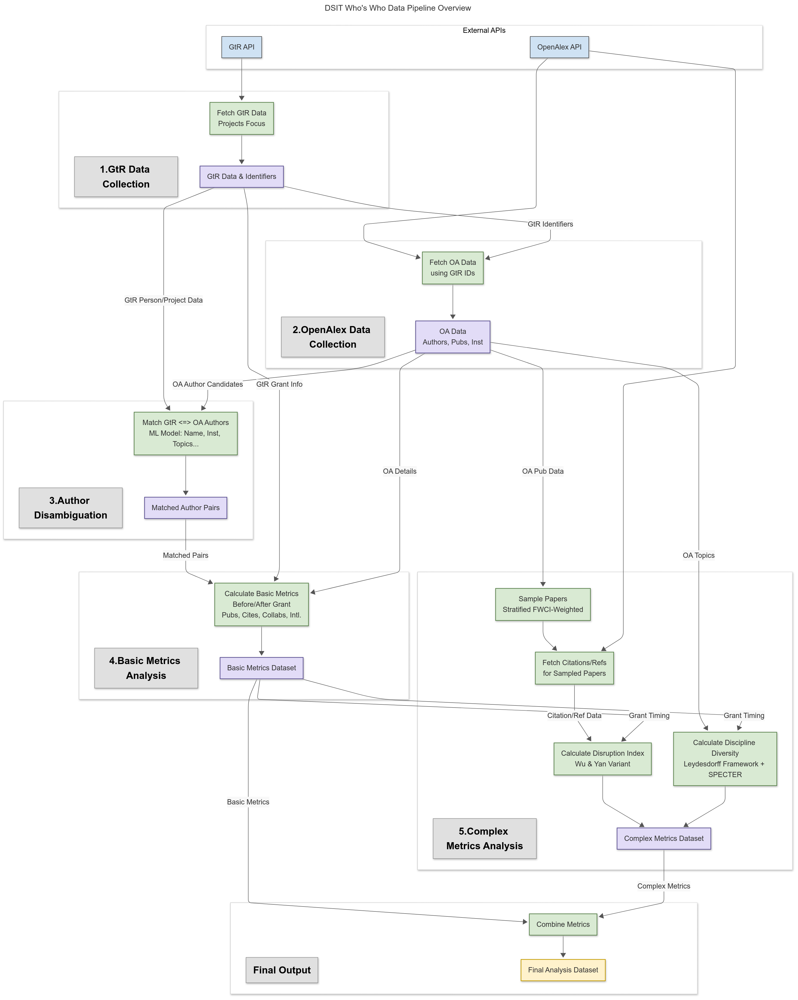

# Who's Who in UK Research

A data pipeline for linking Gateway to Research (GtR) and OpenAlex data to analyse research impact at the individual researcher level.

<p align="center">
    
</p>

## Installation

To set up the project environment, install the required dependencies:

```bash
pip install -r requirements.txt
```

Configuration settings for pipelines, APIs, and parameters are managed within the `conf/` directory.

## Pipelines Overview

The project is structured around five core Kedro pipelines that sequentially process data from initial collection through to complex metric computation:

### 1. Gateway to Research Data Collection (`data_collection_gtr`)
This pipeline fetches data primarily concerning research projects from the UKRI Gateway to Research (GtR) API. It extracts project details, research topics, subjects, funding information, and linked publications. The process includes robust error handling, retry mechanisms, and rate limiting.

### 2. OpenAlex Data Collection (`data_collection_oa`)
This pipeline collects complementary data from the OpenAlex API. It uses identifiers gathered from GtR (ORCID iDs, author names, publication DOIs) to fetch corresponding author profiles, publication records, and institutional details. Data retrieval is optimised through parallel processing and batching.

### 3. Author Disambiguation (`author_disambiguation`)
This pipeline matches researchers identified in GtR with their likely profiles in OpenAlex. It employs a machine learning model trained on features including name similarity, institutional affiliation, research topics, publication history, and author metadata. Strategies like SMOTE or class weighting address the inherent class imbalance. The model aims to link GtR individuals to their OpenAlex counterparts accurately.

### 4. Basic Metrics Analysis (`data_analysis_basic_metrics`)
This pipeline calculates fundamental bibliometric and career indicators for the matched researchers. It computes metrics such as publication counts, citation impact (using both publication-year and citation-year attribution), h-index, i10-index, academic age, international affiliations, and collaboration patterns. Metrics are often calculated separately for periods before and after the researcher's first recorded GtR grant, enabling temporal analysis.

### 5. Complex Metrics Analysis (`data_analysis_complex_metrics`)
This pipeline computes more advanced bibliometric indicators requiring significant computation:
*   **Disruption Index:** Implements the Wu & Yan (2019) variant to measure whether a paper's citations indicate a shift in the research direction (disruptive) or consolidation of existing work. Author-level indices are calculated as both unweighted and Field-Weighted Citation Impact (FWCI) weighted averages. Due to computational demands, this calculation uses a stratified sample of each author's publications.
*   **Discipline Diversity:** Following Leydesdorff et al. (2019), this calculates diversity based on the variety (breadth of topics), evenness (distribution across topics), and disparity (cognitive distance between topics, using SPECTER embeddings).

## Running the Pipelines

Each pipeline can be executed independently using Kedro commands:

```bash
# GtR data collection
kedro run --pipeline data_collection_gtr

# OpenAlex data collection
kedro run --pipeline data_collection_oa

# Author disambiguation
kedro run --pipeline author_disambiguation

# Basic metrics analysis
kedro run --pipeline data_analysis_basic_metrics

# Complex metrics analysis
kedro run --pipeline data_analysis_complex_metrics
```

You can also run the complete sequence of pipelines if needed, though this may take significant time depending on data volume and API constraints. Specific sub-parts of pipelines can often be run using tags (refer to individual pipeline READMEs for details).

## Final Dataset Structure

The final dataset (`analysis.final_metrics.primary`) combines information from GtR and OpenAlex, along with calculated metrics. Key variables are grouped as follows:

| Category                            | Example Variables                                                                                                                                                                                                                                                           |
| :---------------------------------- | :-------------------------------------------------------------------------------------------------------------------------------------------------------------------------------------------------------------------------------------------------------------------------- |
| **Identifiers & Metadata**        | `oa_id`, `orcid`, `gtr_person_id`, `display_name`, `display_name_alternatives`, `first_name`, `surname`, `match_probability`, `gtr_organisation`, `gtr_organisation_name`, `affiliations`, `last_known_institutions`, `last_known_institution_uk`, `first_work_year`, `earliest_start_date` |
| **Funding Information (GtR)**     | `has_active_project`, `number_grants`, `has_multiple_funders`, `grant_categories`, `lead_funders`, `gtr_project_timeline`, `gtr_project_id`, `gtr_project_publications`, `gtr_project_topics`, `gtr_project_oa_authors`, `gtr_project_oa_ids`                                  |
| **Overall Bibliometrics**         | `works_count`, `cited_by_count`, `citations_per_publication`, `h_index`, `i10_index`, `topics`, `counts_by_year`, `counts_by_pubyear`                                                                                                                                               |
| **Basic Metrics (Before/After)**  | `academic_age_at_first_grant`, `n_pubs_before`/`_after`, `total_citations_pubyear_before`/`_after`, `mean_citations_pubyear_before`/`_after`, `citations_pp_pubyear_before`/`_after`, `mean_citations_before`/`_after`, `citations_pp_before`/`_after`, `mean_fwci_before`/`_after` |
| **Intl. Exp. (Before/After)**     | `abroad_experience_before`/`_after`, `countries_before`/`_after`, `abroad_fraction_before`/`_after`                                                                                                                                                                                 |
| **Collaboration (Before/After)**  | `collab_countries_before`/`_after`, `collab_countries_list_before`/`_after`, `unique_collabs_before`/`_after`, `total_collabs_before`/`_after`, `foreign_collab_fraction_before`/`_after`                                                                                         |
| **Complex Metrics (Before/After)** | Disruption: `mean_disruption_before`/`_after`, `mean_weighted_disruption_before`/`_after`<br>Diversity: `mean_variety_before`/`_after`, `mean_evenness_before`/`_after`, `mean_disparity_before`/`_after`                                                                       |
| **Time Series Data**                | `author_year_disruption`, `author_year_diversity`                                                                                                                                                                                                                                |

---

## Dependencies

Key dependencies include:
- Python 3.8+
- Kedro
- pandas
- scikit-learn
- PyTorch (for SPECTER model embeddings)
- requests
- joblib
- openalex-api
- fuzzywuzzy
- python-Levenshtein

Please refer to `requirements.txt` and `pyproject.toml` for a complete list of dependencies and version specifications.

## References

- Wu, L., Wang, D., & Evans, J. A. (2019). Large teams develop and small teams disrupt science and technology. *Nature*, *566*(7744), 378-382. ([arXiv version](https://doi.org/10.48550/arXiv.1905.03461))
- Leydesdorff, L., Wagner, C. S., & Bornmann, L. (2019). The European Union challenge for innovation studies: A decomposition analysis of the Rate of Return on Investment (ROI) in the case of the Framework Programmes (FP6 and FP7). *Journal of Informetrics*, *13*(1), 339-350. ([https://doi.org/10.1016/j.joi.2018.12.006](https://doi.org/10.1016/j.joi.2018.12.006))
- Leibel, E., & Bornmann, L. (2023). Disruption indices: A critical examination and prospects for a research program. *Quantitative Science Studies*, *4*(3), 519-541. ([arXiv version](https://doi.org/10.48550/arXiv.2308.02383))
